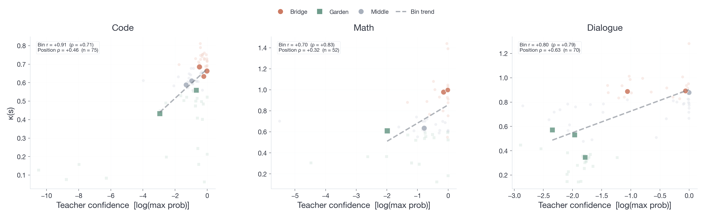
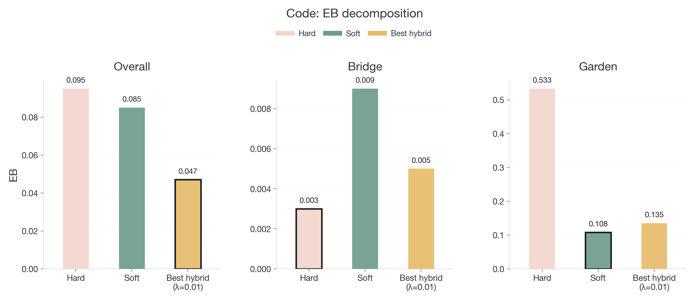
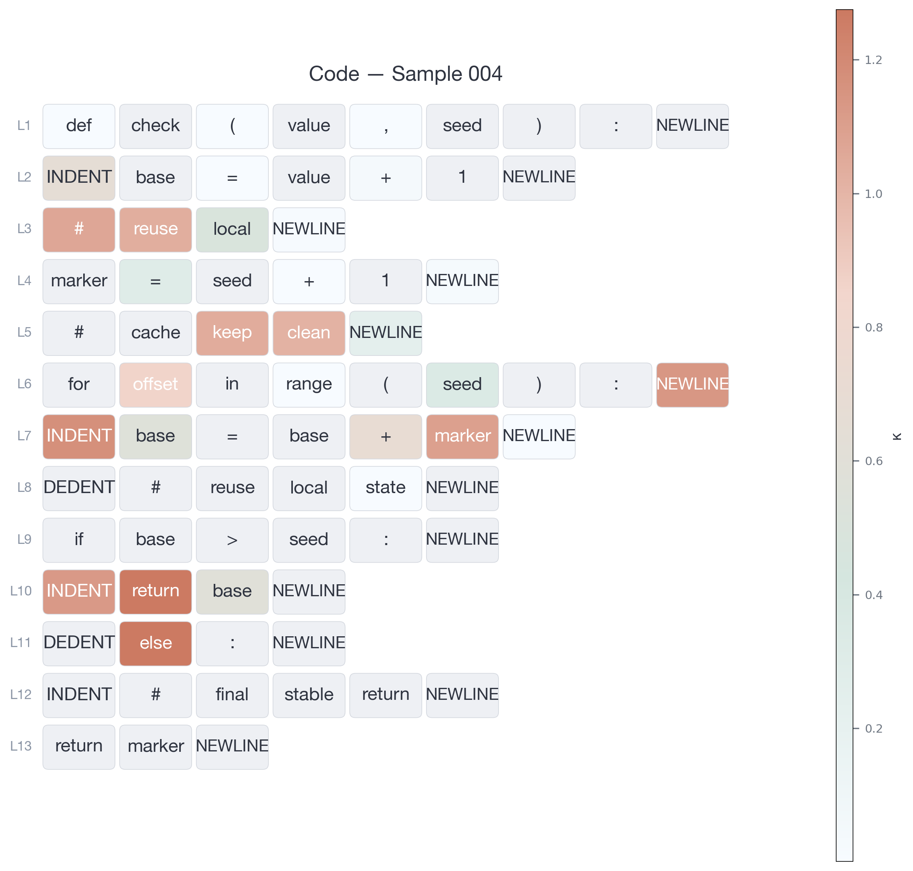

**Tab. 1. Synthetic experiment results across 3 domains.** We synthesize sequences in 3 domains (Code, Math, Dialogue), each with ~120–180 token vocabulary, 512 training + 128 test sequences, and ground-truth Bridge/Garden annotations. Teacher: 3-layer 128-dim 4-head Transformer, trained 4 epochs (AdamW, lr 3e-4). Student: 2-layer 64-dim, distilled under Hard KD (CE on teacher argmax), Soft KD (forward KL), and Hybrid (λ·soft + (1−λ)·hard). Ground-truth κ computed via path sampling. EB = KL on student-generated sequences minus KL on teacher-forced prefixes. **Hard KD achieves lower Bridge EB in all 3 domains; Soft KD achieves lower Garden EB in all 3 domains; Hybrid achieves lowest overall EB.**

**EB decomposition** (lower = less error accumulation):

|Domain|Hard Bridge EB|Soft Bridge EB|Hard Garden EB|Soft Garden EB|
|-|-|-|-|-|
|Code|0.003|0.009|0.533|**0.108**|
|Math|0.019|0.067|0.116|**0.086**|
|Dialogue|0.004|0.215|0.186|**0.056**|

**κ-confidence correlation and overall EB:**

|Domain|κ-conf. r|Overall EB (Hard)|Overall EB (Soft)|Overall EB (Hybrid)|
|-|-|-|-|-|
|Code|**0.91**|0.095|0.085|**0.047**|
|Math|**0.70**|0.068|0.081|**0.049**|
|Dialogue|**0.80**|0.032|0.070|**0.010**|

---

**Fig. 1. κ–confidence scatter (3 domains).** Bin-level Pearson r = 0.91 (Code), 0.70 (Math), 0.80 (Dialogue).

**Fig. 2. EB decomposition (Code domain).**

**Fig. 3. Token-level κ heatmap (Code, sample 004).**

Math and Dialogue results: [synthetic_figures/](synthetic_figures/)

---

**Tab. 2. New pair: Qwen2.5-32B → 3B (general reasoning).**

| Method | BBH | MMLU | ARC-C | ThmQA | Avg |
|--------|-----|------|-------|-------|-----|
| Hard KD | 34.35 | 67.18 | 79.45 | 23.05 | 51.01 |
| Soft KD | 43.97 | 65.56 | 78.07 | 22.85 | 52.61 |
| **Hybrid KD** | **45.73** | **66.82** | **80.02** | **23.98** | **54.14** |

---

**Tab. 3. New pair: Qwen2.5-Coder-7B → 1.5B (code).**

| Method | HE | HE+ | MBPP | MBPP+ | Avg |
|--------|-----|------|------|-------|-----|
| Hard KD | 54.3 | 50.0 | 60.3 | 52.1 | 54.2 |
| Soft KD | 52.7 | 47.9 | 59.6 | 52.4 | 53.1 |
| **Hybrid KD** | **55.5** | **50.6** | **61.4** | **52.6** | **55.0** |

---

**Tab. 4. On-policy + hybrid KD: Qwen2.5-Coder-7B → 1.5B.** Combining on-policy with hybrid yields further gains over on-policy alone.

| Method | HE | HE+ | MBPP | MBPP+ | Avg |
|--------|-----|------|------|-------|-----|
| Off-policy soft KD | 52.7 | 47.9 | 59.6 | 52.4 | 53.1 |
| Off-policy hybrid KD | 55.5 | 50.6 | 61.4 | 52.6 | 55.0 |
| On-policy soft KD | 56.4 | 51.5 | 61.4 | 53.2 | 55.6 |
| **On-policy + hybrid KD** | **56.8** | **52.9** | **61.1** | **52.9** | **55.9** |

---

**Tab. 5. On-policy + hybrid KD: Llama3.1-8B → 1B.**

| Method | BBH | MMLU | ARC-C | ThmQA | Avg |
|--------|-----|------|-------|-------|-----|
| Off-policy soft KD | 22.07 | 33.13 | 33.41 | 4.37 | 23.25 |
| Off-policy hybrid KD | 27.44 | 35.64 | 37.01 | 5.00 | 26.27 |
| On-policy soft KD | 26.84 | 36.15 | 39.73 | 6.95 | 27.42 |
| **On-policy + hybrid KD** | **27.16** | **36.69** | **40.22** | **7.10** | **27.79** |

---

**Tab. 6. On-policy + hybrid KD: DeepSeek-Coder-6.7B → 1.3B.**

| Method | HE | HE+ | MBPP | MBPP+ | Avg |
|--------|-----|------|------|-------|-----|
| Off-policy soft KD | 38.4 | 33.5 | 63.5 | 51.6 | 46.8 |
| Off-policy hybrid KD | 41.5 | 36.6 | 63.2 | 50.5 | 48.0 |
| On-policy soft KD | 43.3 | 39.0 | 63.8 | 52.1 | 49.5 |
| **On-policy + hybrid KD** | **44.2** | **39.8** | **64.4** | **52.5** | **50.2** |

---

**Tab. 7. Regularization/temperature baselines: Qwen2.5-7B → 3B (general reasoning).** Entropy reg., T: high→low, and T: low→high all improve over pure soft KD. Random-label mixing performs worst because random tokens fail to reduce EB at Bridge positions.

| Method | BBH | MMLU | ARC-C | ThmQA | Avg |
|--------|-----|------|-------|-------|-----|
| Soft KD | 41.65 | 64.45 | 78.33 | 23.02 | 51.86 |
| +Entropy reg. | 46.58 | 67.04 | 80.49 | 23.80 | 54.48 |
| T: high→low | 45.22 | 66.10 | 80.12 | 23.77 | 53.80 |
| T: low→high | 46.41 | 66.51 | 80.56 | 23.30 | 54.20 |
| Random-label mixing | 40.10 | 61.24 | 74.23 | 20.27 | 48.96 |
| **Hybrid KD (ours)** | **46.54** | **69.05** | **81.23** | **23.82** | **55.16** |

---

**Tab. 8. Regularization/temperature baselines: Qwen2.5-Coder-7B → 1.5B (code).**

| Method | HE | HE+ | MBPP | MBPP+ | Avg |
|--------|-----|------|------|-------|-----|
| Soft KD | 52.7 | 47.9 | 59.6 | 52.4 | 53.1 |
| +Entropy reg. | 53.0 | 48.2 | 63.5 | 55.3 | 55.0 |
| T: high→low | 53.0 | 47.6 | 60.3 | 52.6 | 53.4 |
| T: low→high | 54.0 | 48.7 | 60.9 | 51.9 | 53.9 |
| Random-label mixing | 51.8 | 48.2 | 60.6 | 53.2 | 53.5 |
| **Hybrid KD (ours)** | **55.5** | **50.6** | **61.4** | **52.6** | **55.0** |

---

**Tab. 9. Regularization/temperature baselines: Llama3.1-8B → 1B (general reasoning).**

| Method | BBH | MMLU | ARC-C | ThmQA | Avg |
|--------|-----|------|-------|-------|-----|
| Soft KD | 22.07 | 33.13 | 33.41 | 4.37 | 23.25 |
| +Entropy reg. | 24.52 | 35.73 | 34.88 | 5.96 | 25.27 |
| T: high→low | 26.02 | 35.08 | 34.74 | 5.78 | 25.41 |
| T: low→high | 25.68 | 35.38 | 34.78 | 4.97 | 25.20 |
| Random-label mixing | 19.17 | 30.10 | 30.23 | 2.13 | 20.41 |
| **Hybrid KD (ours)** | **27.44** | **35.64** | **37.01** | **5.00** | **26.27** |

---

**Tab. 10. Regularization/temperature baselines: DeepSeek-Coder-6.7B → 1.3B (code).**

| Method | HE | HE+ | MBPP | MBPP+ | Avg |
|--------|-----|------|------|-------|-----|
| Soft KD | 38.4 | 33.5 | 63.5 | 51.6 | 46.8 |
| +Entropy reg. | 41.5 | 36.6 | 61.6 | 50.0 | 47.4 |
| T: high→low | 40.1 | 35.4 | 62.7 | 49.9 | 47.0 |
| T: low→high | 39.7 | 34.7 | 62.9 | 50.3 | 46.9 |
| Random-label mixing | 35.4 | 32.3 | 57.4 | 47.6 | 43.2 |
| **Hybrid KD (ours)** | **41.5** | **36.6** | **63.2** | **50.5** | **48.0** |

---

**Tab. 11. AlpacaEval (GPT-5.2 judge, win rate against text-davinci-003).**

| Setting | Hard KD | Soft KD | Hybrid KD |
|---------|---------|---------|-----------|
| Qwen2.5-7B → 3B | 57.5 | 61.3 | **64.4** |
