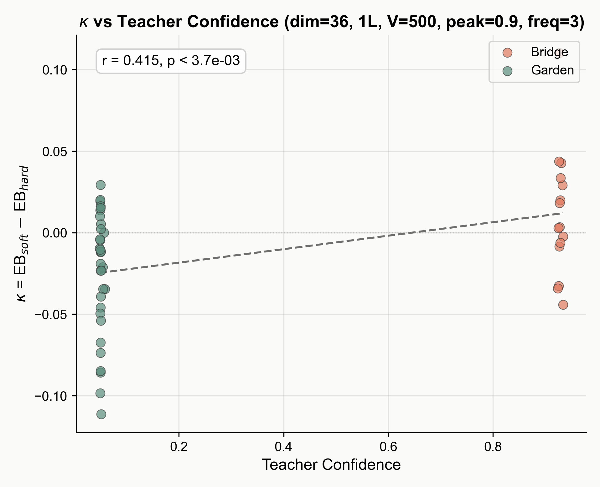
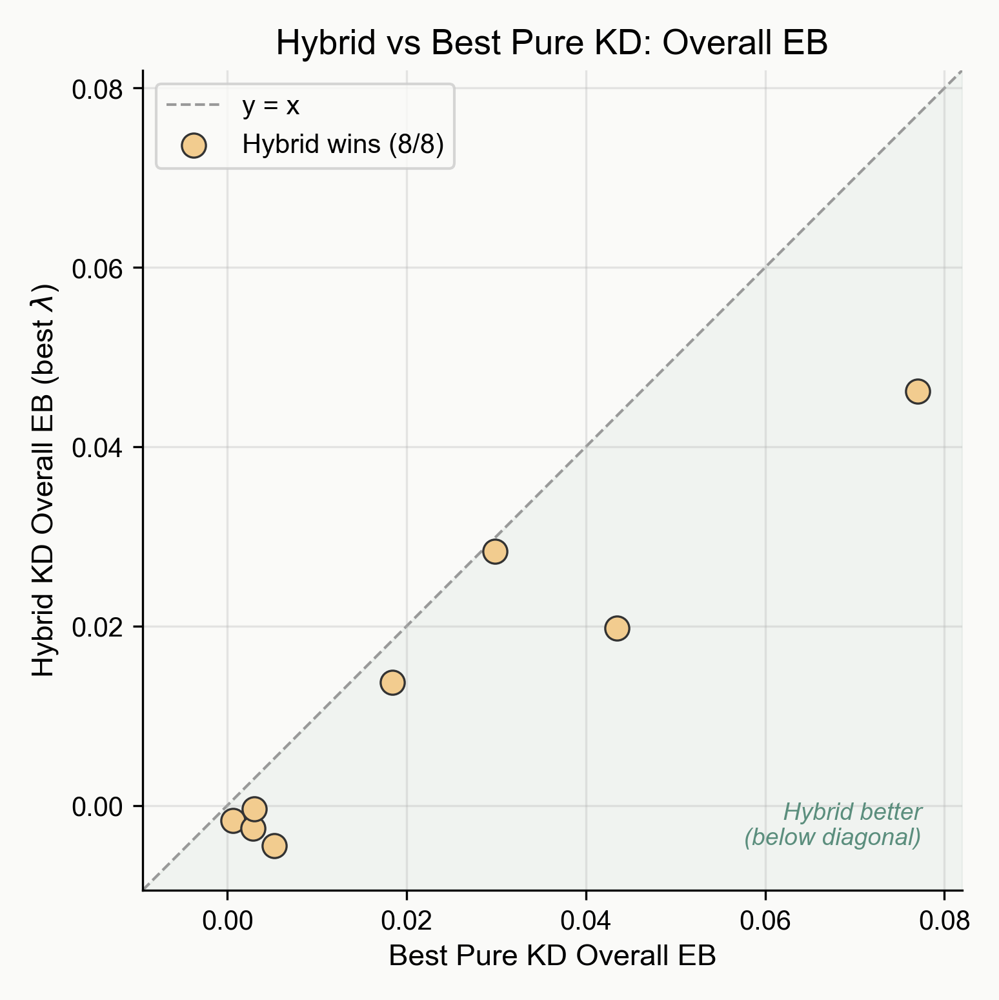
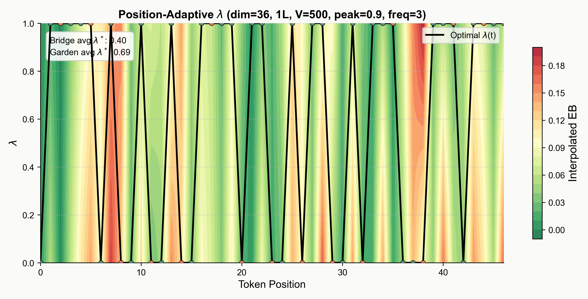
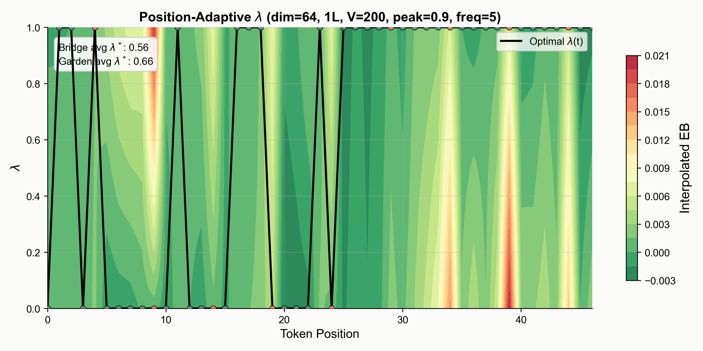

**Tab. S1.** Directory of supplementary materials for Reviewer BfWQ.

| # | Item | Addresses |
|---|------|-----------|
| Tab. S2 | 27-setting synthetic validation | W1 (κ proxy fidelity across settings) |
| Fig. S1 | Synthetic sequence design | W1 (Bridge/Garden definition) |
| Fig. S2 | Per-position landscape (d=36) | W1 (κ vs EB structure) |
| Fig. S3 | κ scatter (d=36) | W1 (teacher confidence as κ proxy) |
| Fig. S4 | Aggregate EB bars (d=36) | W1, W2 (crossover with numbers) |
| Fig. S5 | Slopegraph (15 settings) | W1 (crossover generality) |
| Fig. S6 | Lambda sweep | W2 (hybrid robustness) |
| Fig. S7 | Hybrid vs best pure (27 settings) | W2 (hybrid dominance) |
| Fig. S8 | Contour (d=36, f=3) | W1 (position-adaptive λ) |
| Fig. S9 | Contour (d=64, f=5) | W1 (robustness to bridge frequency) |

**Tab. S2.** Synthetic validation of the Bridge-Garden mechanism across 27 settings. Each setting varies model dimension (d), depth (L), vocabulary size (V), and teacher confidence level (p). All settings use seq=48 and bridge frequency f=3 unless noted. κ corr. = Pearson |r| between teacher confidence and ground-truth κ. Bridge/Garden EB = per-region exposure bias under hard/soft KD. Hybrid EB = overall EB under optimal mixing coefficient λ\*. In every setting, hard KD achieves lower EB in the Bridge region while soft KD achieves lower EB in the Garden region, and hybrid outperforms both pure strategies. Setting #8 (marked †) uses f=5; its κ correlation is 0.751 (below the 0.8 threshold of the other 26 settings) but the crossover pattern still holds.

| # | Setting | κ corr. | Bridge Hard | Bridge Soft | Garden Hard | Garden Soft | Hybrid EB | λ* |
|---|---------|---------|-------------|-------------|-------------|-------------|-----------|-----|
| 1 | d=36, L=1, V=200, seq=32, p=.90 | .992 | .0161 | .0179 | .0035 | .0021 | **.0085** | 0.3 |
| 2 | d=48, L=1, V=200, seq=32, p=.90 | .989 | .0139 | .0140 | .0041 | .0031 | **.0011** | 0.5 |
| 3 | d=52, L=1, V=200, seq=32, p=.90 | .993 | .0056 | .0071 | -.0015 | -.0021 | **.0000** | 0.7 |
| 4 | d=72, L=1, V=200, p=.75 | .956 | .0060 | .0068 | .0030 | .0025 | **.0007** | 0.5 |
| 5 | d=72, L=1, V=200, p=.85 | .947 | .0091 | .0096 | .0002 | .0001 | **-.0020** | 0.7 |
| 6 | d=64, L=1, V=100, p=.90 | .953 | .0093 | .0095 | -.0013 | -.0015 | **.0013** | 0.5 |
| 7 | d=52, L=1, V=100, p=.90 | .829 | .0219 | .0223 | .0011 | -.0001 | **.0079** | 0.9 |
| 8† | d=64, L=1, V=200, p=.90, f=5 | .751 | .0044 | .0066 | .0010 | .0005 | **.0012** | 0.5 |
| 9 | d=32, L=2, V=200, p=.85 | .887 | .0778 | .0781 | .0324 | .0281 | **.0302** | 0.5 |
| 10 | d=48, L=2, V=200, p=.85 | .989 | .0195 | .0220 | .0001 | -.0003 | **.0038** | 0.9 |
| 11 | d=48, L=2, V=200, p=.90 | .994 | .0098 | .0124 | -.0024 | -.0030 | **.0009** | 0.5 |
| 12 | d=72, L=1, V=200, p=.90 | .980 | .0042 | .0057 | -.0002 | -.0002 | **.0005** | 0.7 |
| 13 | d=52, L=1, V=200, p=.95 | .979 | .0212 | .0213 | .0074 | .0030 | **.0068** | 0.5 |
| 14 | d=36, L=2, V=300, p=.90 | .982 | .0324 | .0345 | .0342 | .0277 | **.0284** | 0.3 |
| 15 | d=48, L=2, V=300, p=.90 | .988 | .0096 | .0143 | .0077 | .0074 | **.0028** | 0.7 |
| 16 | d=64, L=2, V=300, p=.90 | .987 | .0061 | .0070 | -.0019 | -.0020 | **-.0017** | 0.1 |
| 17 | d=36, L=1, V=500, p=.90 | .974 | .0649 | .0671 | .0630 | .0480 | **.0348** | 0.7 |
| 18 | d=48, L=1, V=500, p=.90 | .986 | .0313 | .0321 | .0132 | .0105 | **.0109** | 0.9 |
| 19 | d=52, L=1, V=500, p=.90 | .980 | .0169 | .0202 | .0060 | .0054 | **.0050** | 0.9 |
| 20 | d=48, L=1, V=500, p=.95 | .987 | .0496 | .0561 | .0295 | .0290 | **.0183** | 0.1 |
| 21 | d=64, L=1, V=500, p=.95 | .969 | .0130 | .0139 | .0021 | .0009 | **-.0032** | 0.7 |
| 22 | d=64, L=2, V=500, p=.90 | .984 | .0060 | .0077 | .0014 | .0010 | **-.0026** | 0.7 |
| 23 | d=72, L=2, V=500, p=.90 | .986 | .0109 | .0117 | .0004 | -.0011 | **-.0004** | 0.7 |
| 24 | d=64, L=1, V=1000, p=.90 | .982 | .0287 | .0308 | .0154 | .0126 | **.0137** | 0.9 |
| 25 | d=48, L=1, V=1000, p=.95 | .975 | .0818 | .0838 | .0802 | .0738 | **.0462** | 0.5 |
| 26 | d=64, L=1, V=1000, p=.95 | .992 | .0439 | .0469 | .0448 | .0418 | **.0198** | 0.9 |
| 27 | d=72, L=1, V=1000, p=.95 | .962 | .0147 | .0192 | .0008 | .0006 | **-.0045** | 0.9 |

![Fig. S1. Synthetic sequence with Bridge (B) and Garden (G) tokens annotated. Bridge tokens are computed from an internal automaton state and change it; Garden tokens are sampled freely. A wrong prediction at a Bridge shifts the state to a wrong value and all future Bridge tokens follow an incorrect trajectory (κ ≈ 0.55). At Garden positions, many tokens are acceptable and errors have no downstream effect (κ ≈ 0.07). The teacher is a small transformer trained to convergence; the student is a smaller variant.](figures/02_sequence_level_bridge_garden.png)

