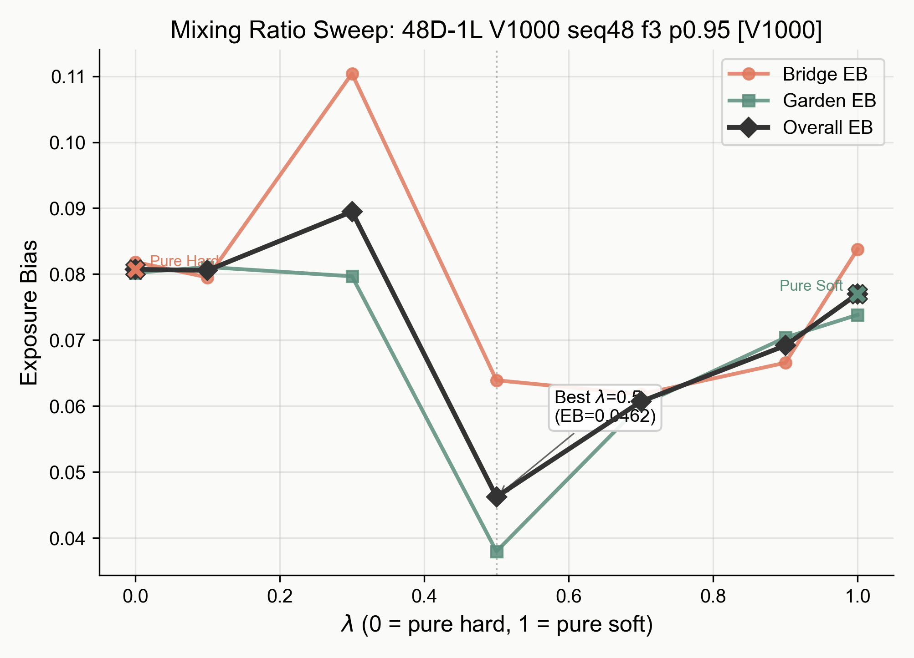

**Tab. S1.** Directory of supplementary materials for Reviewer KyFs.

| # | Item | Addresses |
|---|------|-----------|
| Tab. S2 | On-policy + hybrid KD results | Q2 (on-policy comparison), W1 (hard/soft scope) |
| Tab. S3 | New teacher-student pairs | W1 (generality under larger gaps) |
| Tab. S4 | Training cost comparison | W2 (one-step improvement practicality) |
| Fig. S1 | Lambda sweep | W1 (continuous hard/soft trade-off) |
| Fig. S2 | Slopegraph (15 settings) | Q1 (shared population objective evidence) |

**Tab. S2.** On-policy + hybrid KD results across 5 teacher-student pairs and 3 domains (general reasoning, code, math). Our method is orthogonal to on-policy KD; combining them yields further gains over on-policy soft KD alone.

| Pair | Benchmarks | On-policy Soft KD | On-policy + Hybrid KD |
|------|-----------|-------------------|----------------------|
| Qwen2.5-7B → 3B | BBH / MMLU / ARC-C / ThmQA avg | [TBD] | [TBD] |
| Coder-7B → 1.5B | HumanEval(+) / MBPP(+) avg | [TBD] | [TBD] |
| Llama-3-8B → 1B | BBH / MMLU / ARC-C avg | [TBD] | [TBD] |
| DeepSeek-Coder-6.7B → 1.3B | HumanEval / MBPP avg | [TBD] | [TBD] |
| Qwen-Math-7B → 1.5B | GSM8K / MATH avg | [TBD] | [TBD] |

**Tab. S3.** New teacher-student pairs added during rebuttal to validate generality under larger capacity gaps and different domains.

| Pair | Benchmarks | Hard KD | Soft KD | Hybrid KD |
|------|-----------|---------|---------|-----------|
| Qwen2.5-32B → 3B | BBH / MMLU / ARC-C / ThmQA avg | [TBD] | [TBD] | [TBD] |
| Coder-7B → 1.5B | HumanEval(+) / MBPP(+) avg | [TBD] | [TBD] | [TBD] |

**Tab. S4.** Training cost comparison on Qwen2.5-7B → 3B, 4xA100 80GB. Hybrid adds negligible cost over soft KD because the only extra computation is one log-sum-exp per token to compute the mixing weight.

| Pair | Method | s/step |
|------|--------|--------|
| Qwen2.5-7B → 3B | Soft KD | [TBD] |
| Qwen2.5-7B → 3B | Hybrid KD | [TBD] |
| Qwen2.5-7B → 3B | On-policy KD | [TBD] |

