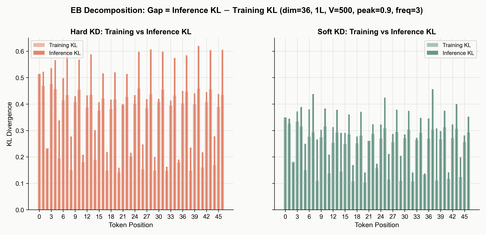

**Tab. S1.** Directory of supplementary materials for Reviewer RfJB.

| # | Item | Addresses |
|---|------|-----------|
| Tab. S2 | Training cost comparison | W4, W5 (cost) |
| Tab. S3 | Regularization / temperature baselines | W6 (alternative navigation strategies) |
| Fig. S1 | Lambda sweep | W3 (no threshold τ needed) |
| Fig. S2 | EB decomposition (d=36) | W1 (κ proxy mechanism) |
| Fig. S3 | Contour (d=36) | W3 (position-adaptive λ) |

**Tab. S2.** Training cost comparison on Qwen2.5-7B → 3B, 4xA100 80GB. Hybrid adds negligible per-step cost over soft KD because the only extra computation is one log-sum-exp per token to compute the mixing weight. On-policy KD requires autoregressive student sampling and is substantially more expensive.

| Method | Extra computation | s/step |
|--------|-------------------|--------|
| Soft KD | none | [TBD] |
| Hybrid KD | 1 log-sum-exp per token | [TBD] |
| On-policy KD | autoregressive student sampling | [TBD] |

**Tab. S3.** Alternative Bridge-Garden navigation strategies compared across 5 teacher-student pairs. The first three baselines (entropy regularization, temperature schedules) improve over pure soft KD, confirming they navigate the same Bridge-Garden trade-off. Random-label mixing performs worst because incorrect hard labels fail to reduce EB at Bridges; teacher-sampled hard labels are essential.

| Method | Qwen 7B→3B | Qwen 32B→3B | Coder 7B→1.5B | Llama 8B→1B | DS-Coder 6.7B→1.3B |
|--------|------------|-------------|---------------|-------------|---------------------|
| Soft KD | [TBD] | [TBD] | [TBD] | [TBD] | [TBD] |
| +Entropy reg. | [TBD] | [TBD] | [TBD] | [TBD] | [TBD] |
| T: high→low | [TBD] | [TBD] | [TBD] | [TBD] | [TBD] |
| T: low→high | [TBD] | [TBD] | [TBD] | [TBD] | [TBD] |
| Random-label mixing | [TBD] | [TBD] | [TBD] | [TBD] | [TBD] |
| Hybrid KD (ours) | [TBD] | [TBD] | [TBD] | [TBD] | [TBD] |

